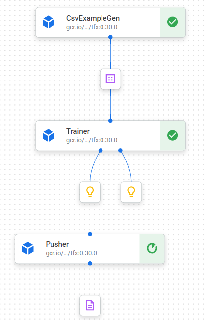

## End2End TFX Pipeline
* [end2end_tfx_pipeline](https://github.com/silverstar0727/ML-Pipeline-Tutorial/tree/main/tfx-pipeline-tutorial/end2end_tfx_pipeline)
  * [tfx-pipeline-python-src](https://github.com/silverstar0727/ML-Pipeline-Tutorial/tree/main/tfx-pipeline-tutorial/end2end_tfx_pipeline/tfx-pipeline-python-src) : tfx pipeline에서 활용되는 python 파일입니다.
    * [constants_trainer.py](https://github.com/silverstar0727/ML-Pipeline-Tutorial/blob/main/tfx-pipeline-tutorial/end2end_tfx_pipeline/tfx-pipeline-python-src/constants_trainer.py) & [inputfn_trainer.py](https://github.com/silverstar0727/ML-Pipeline-Tutorial/blob/main/tfx-pipeline-tutorial/end2end_tfx_pipeline/tfx-pipeline-python-src/inputfn_trainer.py) : 두 파일은 전처리 과정에서 사용됩니다.
    * [model_trainer.py](https://github.com/silverstar0727/ML-Pipeline-Tutorial/blob/main/tfx-pipeline-tutorial/end2end_tfx_pipeline/tfx-pipeline-python-src/model_trainer.py) : 해당 파일은 모델 빌드 및 저장 등의 역할을 합니다.
  * [end2end_tfx_pipeline(Lab).ipynb](https://github.com/silverstar0727/ML-Pipeline-Tutorial/blob/main/tfx-pipeline-tutorial/end2end_tfx_pipeline/end2end_tfx_pipeline(Lab).ipynb): 실습을 진행할 수 있도록 주요 부분을 채워두지 않은 예제입니다.
  * [end2end_tfx_pipeline(Solution).ipynb](https://github.com/silverstar0727/ML-Pipeline-Tutorial/blob/main/tfx-pipeline-tutorial/end2end_tfx_pipeline/end2end_tfx_pipeline(Solution).ipynb): 모두 완성된 예제입니다.

## Simple TFX Pipeline
* [penguin_simple.ipynb](https://github.com/silverstar0727/ML-Pipeline-Tutorial/blob/main/tfx-pipeline-tutorial/penguin_simple.ipynb): 간단한 파이프라인 구성 예제입니다.
#### on GCP(Vertex AI Pipeline)
* [penguin_simple_with_vertex_ai.ipynb](https://github.com/silverstar0727/ML-Pipeline-Tutorial/blob/main/tfx-pipeline/penguin_simple_with_vertex_ai.ipynb): GCP의 새로운 서비스인 Vertex AI Pipeline을 이용하여 TFX를 실행하는 예제입니다.

## 컨퍼런스 영상(GDSC Yonsei Con.)
- [Youtube](https://www.youtube.com/watch?v=Fcu-vbuZ0D0&t) (TFX Pipeline)
- [Youtube](https://www.youtube.com/watch?v=g6xjfe3uEYw&t) (TFT)
- [Youtube](https://www.youtube.com/watch?v=48jS2eI8NIw&t) (TFDV)
